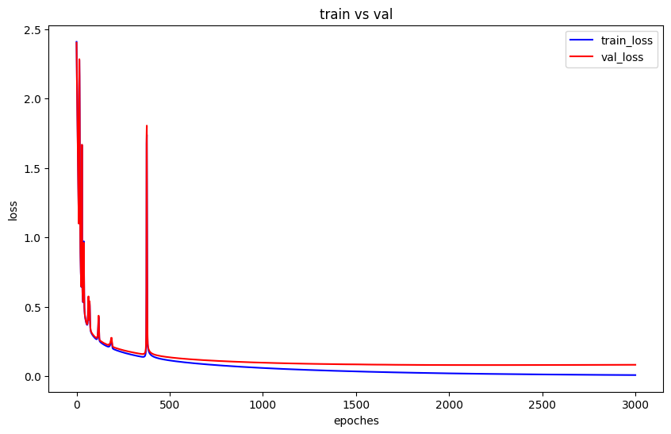

# Building-a-Neural-Network-from-Scratch-with-He-Initialization
A pure Python implementation of a neural network built from scratch without deep learning frameworks (like PyTorch or TensorFlow), featuring custom He initialization to optimize training performance for deep architectures.

# 0. Outline
- [1. Building model](#1-building-model)
- [2. Using He initialization](#2-using-he-initialization)
- [3. Train model with He initialization](#3-train-model-with-he-initialization)

## 1. Building model
### 1.1 Initialize weight
The weight matrices are initialized using CuPy random with zero mean and unit variance.
```
parameters['W'+str(l)] = cp.random.randn(node_num_list[l], node_num_list[l-1])
```

## 1.2 Forward propagation
In this version, the input data is multiplied by randomly initialized weight matrices, and parameters ($W$, $A$, $Z$) are saved for backpropagation.
From layer 1 to $L-1$, the ReLU activation function is used, while the final $L$-layer uses the Softmax activation function for classification.

$$
\text{ReLU}(z) = \max(0, z)
$$

$$
\text{Softmax}(z_i) = \frac{e^{z_i}}{\sum_{j} e^{z_j}}
$$

## 1.3 Compute cost
Once we obtain $\hat{y}$ from forward propagation, we can compute the cost using the cross-entropy loss function

$$
L = -\sum_{i} y_i \log(\hat{y}_i)
$$

## 1.4 back propagation
In this version, we can compute the gradients of each matrix ($dZ$, $dW$, $db$, $dA$) using the following formulas:
#### 1. $dz^{[l]}$

  $$
  dz^{[l]} = da^{[l]} \odot g'(z^{[l]})
  $$

#### 2. $dW^{[l]}$

$$
dW^{[l]} = \frac{1}{m} dz^{[l]} (a^{[l-1]})^T
$$

#### 3. $db^{[l]}$
$$
db^{[l]} = \frac{1}{m} \sum_{i=1}^{m} dz^{[l]}_{(i)}
$$

#### 4. $da^{[l-1]}$
$$
da^{[l-1]} = (W^{[l]})^T dz^{[l]}
$$

## 1.5 Parameter update
We update parameter follow next step

$$
W_\text{new} = W_\text{old} - \text{learning rate} \times dW
$$

$$
b_\text{new} = b_\text{old} - \text{learning rate} \times db
$$

## 1.6 Build model
 
 
This model is trained as shown in the image above to predict labels.

## 1.7 Train and performance
### 1.7.1 Hyper parameters
- number of node of layer : [784, 500, 100, 10]
- training set = X[:, :10000], y[:10000] (X, y is shuffled data)
- val set = X[:, 10000:13000], y[10000:13000] (X, y is shuffled data)
- epochs = 1000
- learning_rate = 0.01

### 1.7.2 Performance


The first epoch resulted in NaN loss, reflecting abnormal training.

Final train loss: NaN

Final val loss: NaN

Dataset accuracy: 0.099

This performance indicates that the training is invalid.

# 2. Using He initialization
## 2.1 Why did NaN occur?

The above graph shows the output of the $Z$ nodes.<br>
As we cam see, the outputs of the $Z3$ nodes have high variance, which cause $e^z$ to become inf.<br>
Consequently, inf/inf results in NaN.

## 2.2 Scaling down Weights

The above graph shows the result after scaling down the weights.<br>
I tried scaling down the weights by multiplying them by 0.1.<br>
Actually, it works in model.

## 2.3 How about deeper model(20 layers)

```
y_hat:  [ 0.  0. nan  0.  0. nan nan nan  0.  0.]
```
However, the above graph and result of y_hat shows that NaN error occurs again In a deeper model (20 layers).<br>
This is because as Z gets larger, its variance also increases.
## 2.4 How about smaller weights
this time I scaled down weight more by multiplying 0.01 and trained it

```
cost of 0th epoch: 2.3026
cost of 100th epoch: 2.3008
cost of 200th epoch: 2.2994
cost of 300th epoch: 2.2982
cost of 400th epoch: 2.2972
cost of 500th epoch: 2.2964
cost of 600th epoch: 2.2958
cost of 700th epoch: 2.2953
cost of 800th epoch: 2.2949
cost of 900th epoch: 2.2945
```
However, the loss decreases too slowly
<br>


```
variance of Z1: 0.0092
variance of Z10: 0.0
variance of Z20: 0.0
```
The above graph shows that as $Z$ gets larger, its variance also decreases. Finally, $dZ_{20}$ becomes almost 0.<br>


<br>
```
mean of dW1: -0.0
variance of dW1: 0.0
mean of dW10: 0.0
variance of dW10: 0.0
mean of dW20: 0.0
variance of dW20: 0.0
```
because $Z_{20}$ is almost zero, $dW$ is also zero due to back propagation
This means that the model is not being trained.

## 2.5 He initialization
### 2.5.1 variance when weight initialization is not applied
```
X_train = cp.random.randn(1000, 100000)
W1 = cp.random.randn(1000, 1000)
W2 = cp.random.randn(1000, 1000)
W3 = cp.random.randn(10, 1000)
Z1 = W1 @ X_train
Z2 = W2 @ Z1
Z3 = W3 @ Z2
```
this node list of model is [1000(input), 1000, 1000, 10]<br>
```
Variance of X1: 1.0001
Variance of Z1: 1000.2228 ≈ 1000
Variance of Z2: 999646.6278 ≈ 10000000 (1000 * 1000)
Variance of Z3: 980496760.7349 ≈ 100000000 (1000*1000*10)
```
From the above result, the variance of the output is almost equal to the product of the number of nodes in the preceding layers

```
import math
# sacling down
X_train = cp.random.randn(1000, 100000)
W1 = cp.random.randn(1000, 1000) * np.sqrt(2/1000)
W2 = cp.random.randn(1000, 1000) * np.sqrt(2/1000)
W3 = cp.random.randn(10, 1000) * np.sqrt(2/1000)

# forward_propagation
Z1 = W1 @ X_train
A1 = relu(Z1)
Z2 = W2 @ A1
A2 = relu(Z2)
Z3 = W3 @ A2
A3 = relu(Z3)
----result------------
Variance of X1: 0.9999
Variance of A1: 0.683
Variance of A2: 0.6752
Variance of A3: 0.6752
```

Therefore, considering $Z$ is passed into ReLU, when weight matrix = weight matrix $\\times \frac{2}{\sqrt{n_{\text{pred}}}}$, the variance of $g(Z)$ is maintained even as the model becomes deeper.
# 3. Train model with He initialization
## 3.1 Edit initialization function
```
def initialize_weight(node_num_list):
    parameters = {}
    for l in range(1, len(node_num_list)):
        parameters['W'+str(l)] = cp.random.randn(node_num_list[l], node_num_list[l-1]) * cp.sqrt(2/node_num_list[l-1])
        parameters['b'+str(l)] = cp.zeros((node_num_list[l],1)) * cp.sqrt(2/node_num_list[l-1])
    return parameters
```
I applied He initialization to the initialize_weight function

## 3.2 Performance
```
X_train = X[:, :65000]
y_train = y_one_hot[:, :65000]

X_val = X[:, 65000:70000]
y_val = y_one_hot[:, 65000:70000]

epoches = 3000
node_num_list = [784, 600, 500, 300, 100, 10]
epoches_list = np.arange(0, epoches)
model = Model(node_num_list)
train_loss_list, val_loss_list = model.train(X_train, y_train, X_val, y_val, 0.1, epoches, True)
```

when I train model with above hyperparameter, 
- Final train loss: 0.008
- Final val loss: 0.082
- Dataset accuracy: 0.998
